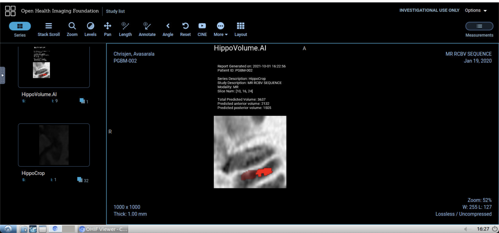

# Hippocampus Volume Segmentation and Quantification using UNET
*This is part of the Udaciy AI for Healthcare Nanodegree course projects.*

There are three sub-tasks in this project:
- Curating the "dirty" dataset and obtain the cleaned version of images/labels.
- Apply a U-net model to 3D MR scans to segment the hippocampal area.
- Integrate the segmentation algorithm into a simulated clinical network to automate 
the segmentation and visualization of hippocampus using MR scans. 

The sample generated report as below:

Before running the scripts, the data should be obtained from 
[here](https://github.com/udacity/nd320-c3-3d-imaging-starter/tree/master/data/TrainingSet)
and run the notebook `/section1/out/EDA.ipynb` to preprocess and remove outliers.
The resulted cleaned dataset need to be copied to `/section2` for the segmentation step.     

For `section3` experiment, the [TestVolumes](https://github.com/udacity/nd320-c3-3d-imaging-starter/tree/master/data/TestVolumes) dataset is used. Additionally, [Orthanc server](https://www.orthanc-server.com/download.php) and [OHIF web viewer](https://docs.ohif.org/development/getting-started.html) and [DCMTK tools](https://dcmtk.org/) need to be installed. The configuration details for Orthanc server and OHIF web viewere can be found [here](https://book.orthanc-server.com/users/lua.html). 
